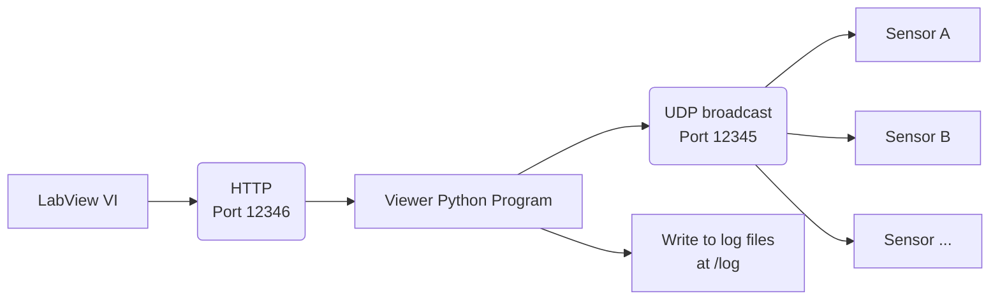

# esp01s-bme280
Code and setup for humidity measurement with ESP-01s and BME280

## Connection
|3.3V Power supply|ESP-01s|BME280|
|:---------------:|:-----:|:----:|
|       Vo+       |  3V3  |  VCC |
|       Vo-       |  GND  |  GND |
|                 |  IO0  |  SCL |
|                 |  IO2  |  SDA |

## Programs

